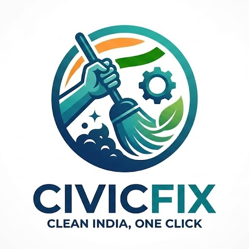

# CivicFix 🌍🛠️
> **Bridging the Gap Between Citizens and Authorities with AI**



## 📖 Table of Contents
- [Problem Statement](#-problem-statement)
- [Tech Stack Analysis](#-tech-stack-analysis)
- [Module 1: Citizen Side](#-module-1-citizen-side-lite-mode)
- [Module 2: Official Side](#-module-2-official-side-dashboard-mode)
- [Installation Guide](#-installation--setup)
- [Future Plans](#-future-plans)
- [Conclusion](#-conclusion)

---

## 🚨 Problem Statement

**The Urgency of Urban Decay**
Rapid urbanization has overwhelmed municipal infrastructure, creating a critical lag between the emergence of civic hazards and their resolution. Issues such as open potholes, uncollected garbage, and waterlogging often remain unreported for days, escalating into public health crises or fatal accidents.

**The Communication Gap**
Citizens often lack a direct, verified channel to communicate with authorities. Traditional reporting methods—such as paper forms or phone hotlines—are slow, opaque, and discouraging. Authorities, in turn, lack real-time data and geolocation precision to prioritize their resources effectively. **CivicFix** bridges this gap by providing an immediate, AI-verified, and location-precise alert system.

---

## 💻 Tech Stack Analysis

CivicFix is built as a **Progressive Web App (PWA)** to ensure accessibility across all devices, especially low-end mobile phones common in the target demographic.

### **Frontend & Core Logic**
* **HTML5 / CSS3 / Bootstrap 5:** Ensures a responsive, mobile-first design that adapts between "Lite Mode" (Mobile) and "Pro Mode" (Desktop).
* **Vanilla JavaScript (ES6+):** Handles all client-side logic without heavy frameworks to maintain high performance.
* **Leaflet.js & OpenStreetMap:** Provides an open-source, interactive mapping solution for the Official Dashboard.

### **Artificial Intelligence (The Brain)**
* **Google Gemini API (Model: `gemini-flash-latest`):** The core intelligence engine. It analyzes uploaded images in real-time to identify hazards (e.g., "Garbage," "Pothole") without user manual input.
* **TensorFlow.js (Edge AI):** Integrated for client-side pre-processing and object detection to reduce server load and verify image relevance before upload.

### **Backend & Infrastructure (Evolution)**
* **Firebase Authentication:** Handles secure user login and role management (Citizen vs. Official).
* **Cloud Firestore:** A NoSQL real-time database that stores user profiles, reports, and leaderboards.
* **Python Flask (Prototype):** Initially developed a Flask backend for handling AI requests.
* **Client-Side Migration:** To reduce latency and hosting complexity, the backend logic was successfully migrated to a serverless architecture using **`logic.js`**, allowing the app to communicate directly with Gemini and Firebase from the browser.

### **Optimization**
* **Smart Compression Algorithm:** A custom JavaScript utility that resizes images (to ~400px on mobile) before upload, preventing browser crashes on low-memory devices.

---

## 📱 Module 1: Citizen Side (Lite Mode)

The Citizen interface is designed for speed and simplicity.

### 1. One-Tap Reporting
Users simply capture a photo. The app automatically captures the **GPS Coordinates** and runs the **Smart Compression** engine.
<br>


### 2. AI Verification
Before submission, Gemini AI analyzes the image to confirm the issue type. This eliminates spam and ensures data quality.
<br>


### 3. Gamification
A competitive environment to be one of the top contributors. It features a "Smart Filter" that allows citizens to compete while ensuring officials see relevant local heroes.
<br>


---

## 🏛️ Module 2: Official Side (Dashboard Mode)

The Official interface acts as a Command Center for municipal authorities.

### 1. Real-Time Heatmap
A visual map populated with markers (Red for Pending, Green for Resolved). Clicking a marker reveals the AI analysis, photo, and exact location.
<br>


### 2. Zone-Specific Data
The system automatically filters reports based on the Official’s jurisdiction (e.g., "Howrah Zone 1"), ensuring they are not overwhelmed by irrelevant data.
<br>


### 3. Status Management
Officials can update the status of a report (`Pending` → `In Progress` → `Resolved`) and leave official comments, which are instantly visible to the reporting citizen.
<br>


---

## 🚀 Demo
Hosted URL: [CivicFix.com](https://civicfix-55318.web.app)  
Demo Video: [CivicFix-video](https://youtu.be/K9isdMzPbVA)


## ⚙️ Installation & Setup

Follow these steps to run the project locally.

### 1. Clone the Repository
```bash
git clone [https://github.com/mukherjeesuchetana514-maker/CivicFix.git](https://github.com/mukherjeesuchetana514-maker/CivicFix)
cd CivicFix
```
### 2. Configure API Keys
This project requires a config.js file for the Gemini API key.

Navigate to the static/js/ folder.

Create a file named config.js.

Add your key inside:

JavaScript
```
window.CONFIG = {
    GEMINI_API_KEY: "YOUR_GEMINI_API_KEY_HERE"
};
```
### 3. Run the Project
Since this is a static web app, you can simply open index.html in your browser. Optional: Use a live server (like the VS Code Live Server extension) for the best experience.

### 🔮 Future Plans
Offline Mode: Implementation of Service Workers to allow reporting even without an active internet connection (data syncs when online).

Government API Integration: Direct integration with municipal work-order systems to automate the dispatch of repair crews.

Predictive Analytics: Using historical data to predict where potholes or waterlogging are likely to occur before they happen.

Video Reporting: Expanding the AI capabilities to analyze short video clips for more context on complex issues.

### 🏁 Conclusion
CivicFix is not just an application; it is digital infrastructure for a safer city. By leveraging Gemini AI for verification and Firebase for real-time communication, we have created a loop that turns passive residents into active participants in city governance. It transforms the civic grievance process from a "complaint box" into a "collaboration tool," ensuring that when a citizen speaks, the city listens—and acts.

